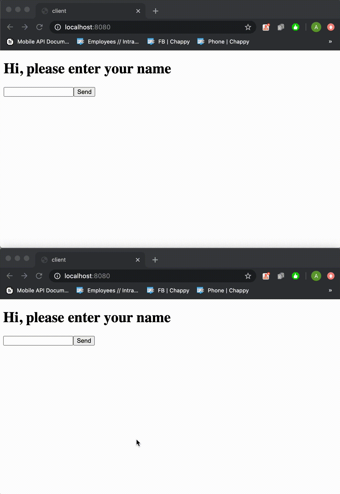

# ComposeWebUI
## ...or kinda server side rendering using compose

Works on dev-14 with minor changes (commit hash: d7bc850db8)

Now [live on Heroku](https://compose-test-app.herokuapp.com/)!



This is a prototype of porting compose to ktor server rather than running it on Android.

The original idea belongs to [SwiftWebUI](https://github.com/SwiftWebUI/SwiftWebUI) project,
rendering HTML page using websocket commands from server.

### How it works?

Server renders a web page, which creates a websocket connection. Then, server pushes updates for 
adding/removing/replacing HTML nodes on the page, while client is pushing events back. 
In some way, it is similar to Virtual DOM, but server side.

### Building it
Build requires you to have AOSP repository with compose on your local machine.

Add its path to `local.properties` file:
```properties
aosp.location=/location/to/repo/aosp
```

Now, you can build the `integration` module, which contains full stack implementation of actual app. Ideally, this is the 
one you could write if this library will be ever published.

The library with all definitions is in `server` module and the similarly, JS library is in `client` one.
