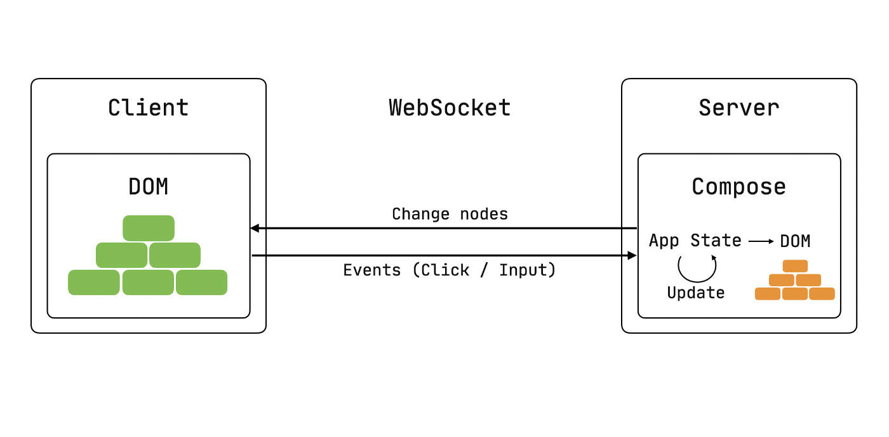

# Compose on the server side

Now [live on Heroku](https://compose-test-app.herokuapp.com/)!

This is a prototype of porting compose as a feature of a Ktor server rather than running it on Android.

The original idea belongs to [SwiftWebUI](https://github.com/SwiftWebUI/SwiftWebUI) project,
rendering HTML page using websocket commands from server.

Works with dev-15 with minor changes.

### Show me the code!
```kotlin
fun Application.module() {
    install(Compose)

    routing {
        compose {
            var state by remember { mutableStateOf(1) }
            h1 { 
                text("Counter value is $state") 
            }
            button(Modifier.onClick { state++ }) { 
                text("Increment!")
            }
        }
    }
}
```

### How does it work?
#### **TLDR;** Compose + Websocket goes brrrr



- Compose starts with some initial state which results in the server-side representation of a webpage.
- This representation is sent to the client as commands of adding/removing/moving nodes through websocket. 
  The client then changes the structure of the webpage according to commands received from the server.
- When a client event happens (for example click), it is sent to the server. Here, the state is updated with the new changes. 
  It yields a different structure of the DOM, and these updates are sent to the client, refreshing the webpage.

Full story [on Medium](https://medium.com/@shikasd/composing-in-the-wild-145761ad62c3?source=friends_link&sk=1ea110938835f2ad11c7a2b39e5deac1).

### Building it
You can use `deploy` branch with prebuilt artifacts of runtime.

`integration` module contains implementation of an on both JS and server side. Ideally, this is the part you could write if this library will be ever published.

The Ktor feature with all the definitions is in the `server` module and browser runtime is in the `client` one.
